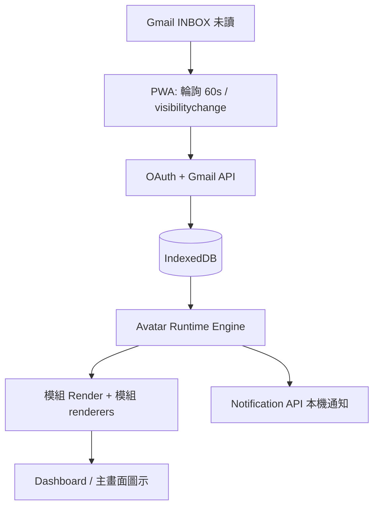

# Feature Specification: PWA Avatar Notification Platform — Gmail 未讀 Avatar（001）

**Platform**: 🌐 PWA Avatar Notification Platform  
**Feature Branch**: `001-gmail-standby-unread`  
**Created**: 2026-05-24  
**Status**: Draft (amended 2026-05-24 — manifest schema v1.0.0 結構化 animation + performance)

**Input**: Gmail 未讀驅動待機／通知 Avatar；PWA 雙平台；模組熱插拔；未讀重置規則二擇一。  
**架構來源**: 使用者提供之「PWA Avatar Notification Platform」心智圖（本 spec 已融合，並標註 MVP／未來）。

---

## Product Vision

以 **PWA** 為核心 Runtime，透過 **Avatar Runtime Engine** 將「未讀／訊息狀態」映射為 **Avatar 情緒狀態**（sleep / normal / busy / panic），並由 **可熱插拔的 Avatar 模組**（`modules/{pack-id}/`）渲染靜態圖或動畫，最終呈現於 **主畫面捷徑、PWA 全螢幕 Dashboard、鎖定畫面通知**（iOS／Android）。

**本 Feature（001）** 為平台之第一個垂直切片：**Gmail 未讀** 作為唯一訊息來源；其餘來源（LINE、Messenger 等）列為未來擴充。

---

## Clarifications

### Session 2026-05-24

- Q: Gmail 未讀是否只算 INBOX？ → A: **是，僅計 INBOX 未讀**（不含 Promotions／Social 等分類，除非後續產品擴充）。
- Q: MVP 是否必須上 C# Web Push？ → A: **否**。MVP 採 **PWA 前景輪詢 60 秒**、`visibilitychange` 立即刷新、**Notification API 本機通知**；C# Web Push 列 Phase 2。
- Q: Lottie 是否由 App 內建 lottie-web？ → A: **否**；**每個模組自帶 renderer**（`manifest.renderers`）。內建預設模組：**`public/modules/cat-pack/`**。

---

## Platform Architecture（融合心智圖）

```text
🌐 PWA Avatar Notification Platform
│
├── 1️⃣ PWA 前端（核心 Runtime）                    [MVP]
│   ├── SPA 框架（規劃偏好 Vue；見 Planning Inputs）
│   ├── Service Worker
│   ├── IndexedDB（本機資料）
│   ├── Notification API（本機通知，MVP）
│   ├── 前景輪詢 60s + visibilitychange 刷新（MVP）
│   └── Offline Cache（殼層與模組資源快取）
│
├── 2️⃣ Avatar Runtime Engine（核心）               [MVP]
│   ├── 狀態引擎（State Engine）
│   ├── 狀態 Mapping（未讀區間 → Avatar 狀態）
│   ├── 模組 Loader（掃描、驗證、註冊）
│   └── Render Engine（圖片／動畫、狀態轉場）
│
├── 3️⃣ 模組系統（核心架構）                        [MVP]
│   ├── modules/{pack-id}/（local；CDN 為最佳努力）
│   ├── manifest.json + 狀態資源 + animations/
│   └── 自動偵測、清單、預覽、啟用／停用、版本
│
├── 4️⃣ 本機資料層（IndexedDB）                     [MVP]
│   ├── messages
│   ├── unread_counter
│   ├── installed_modules
│   └── user_settings
│
├── 5️⃣ 後端（Minimal API）                         [Phase 2]
│   ├── Web Push 訂閱與觸發（MVP 不做）
│   ├── Webhook Receiver
│   └── Stateless；模組 CDN／商城 API [未來]
│
├── 6️⃣ 外部訊息來源                                [MVP: Gmail only]
│   ├── Gmail [MVP]
│   └── LINE / Messenger / Internal [未來]
│
├── 7️⃣ UI 系統                                     [MVP]
│   ├── Avatar Dashboard
│   ├── 模組選擇頁
│   ├── 訊息列表（Gmail 未讀摘要）
│   └── 設定頁
│
├── 8️⃣ 資料流                                      [見下方 Data Flow]
│
└── 9️⃣ 未來擴充                                    [Out of Scope MVP]
    ├── Live2D、AI Avatar、模組商城、使用者自製模組
    ├── 雲端同步、Theme Engine
    └── 統一訊息匯流排（所有來源經後端）
```

### Planning Inputs（供 `/speckit-plan`，非實作定案）

| 層級 | 規劃偏好（來自心智圖） |
|------|------------------------|
| 前端 | Vue（React 為替代）；TypeScript |
| 後端 | C# ASP.NET Core Minimal API；Stateless |
| 模組路徑 | `/modules/`（或 `public/modules/`） |
| 預設框架 | 見「Avatar 狀態與預設 Mapping」 |

---

## 職責分離：manifest ≠ 未讀區間

| 項目 | 由誰定義 | 存放位置 |
|------|----------|----------|
| 各狀態的**圖片／動畫資源** | 模組作者 | `modules/{pack-id}/manifest.json` → `states.*` |
| **未讀幾封 → 哪個狀態** | **使用者**（設定頁） | IndexedDB `user_settings.stateThresholds` |
| 轉場時間／曲線 | 模組作者（可選覆寫） | `manifest.transitions`；全域預設於 plan |

`manifest.json` **不得**包含未讀門檻數字；未讀 Mapping 僅能來自使用者設定（或 App 出廠預設，仍可於設定頁修改）。

---

## Avatar 狀態與使用者自訂 Mapping

**Avatar 狀態**（固定四種；模組 MUST 在 `states` 內提供對應資源）：

| 狀態 | 語意 |
|------|------|
| `sleep` | 無壓力／低未讀 |
| `normal` | 正常 |
| `busy` | 忙碌 |
| `panic` | 高壓 |

### 出廠預設（首次安裝，寫入 `user_settings`）

| 狀態 | 預設未讀區間（含邊界） |
|------|------------------------|
| `sleep` | 0 封 |
| `normal` | 1–5 封 |
| `busy` | 6–20 封 |
| `panic` | 21 封以上（上限無限） |

### 設定頁：狀態門檻編輯器（MVP 必備）

設定頁 MUST 提供 **「Avatar 狀態門檻」** 區塊，讓使用者分別為 `sleep`、`normal`、`busy`、`panic` 設定對應的**未讀信件數區間**：

- 每個狀態編輯：**最小未讀數（min）**、**最大未讀數（max）**；`panic` 的 max 可為「無上限」。
- UI MUST 即時預覽：輸入測試未讀數 N → 顯示將落入哪一狀態及使用中模組之預覽圖。
- 儲存前 MUST 驗證：
  - 四個區間合併後完整覆蓋 **0 ～ ∞** 的整數未讀數；
  - 區間彼此**不重疊、無空隙**；
  - 每個狀態 `min ≤ max`（max 為 null 時僅允許於最高壓狀態）。
- 儲存後寫入 `user_settings.stateThresholds`；狀態引擎僅讀此設定（與規則一／二之「顯示用未讀數」搭配）。

**狀態引擎**：`displayUnread` → 查 `stateThresholds` → 得到狀態 key → 從**使用中模組**的 `manifest.states[key]` 載入資源 → Render Engine（含 `manifest.transitions`）。

---

## Module Pack 結構與 manifest.json 契約

模組為**固定目錄版型**；`manifest.json` 內所有路徑為**相對模組根目錄**。資料夾名稱 SHOULD 與 `manifest.id` 一致（如 `cat-pack/` ↔ `"id": "cat-pack"`）。

### 標準目錄結構（作者規格）

```text
modules/{module-id}/
│
├── manifest.json
├── preview.webp                 # 設定頁／模組清單預覽
│
├── states/                      # 四狀態靜態圖（必填）
│   ├── sleep.webp
│   ├── normal.webp
│   ├── busy.webp
│   └── panic.webp
│
├── animations/                  # 可選；各狀態動畫
│   └── panic.json               # 範例：Lottie JSON
│
├── renderers/                   # 模組自帶渲染器（json+lottie 時必填）
│   ├── lottie-renderer.mjs
│   └── vendor/                  # 可選：模組內嵌依賴
│
└── assets/                      # 可選；保留給未來擴充
    └── reserved_future_assets/ # Loader 掃描時忽略內容，不影響啟用
```

> **注意**：`states/` 內四張 `.webp` 為**靜態 fallback**；當 `animation` 非 null 時，Render Engine 優先播放動畫，失敗時 fallback 至對應 `image`。

### 支援的資源格式（MVP）

| 用途 | 路徑慣例 | 允許副檔名 | 說明 |
|------|----------|------------|------|
| 模組預覽 | 根目錄 | `.webp` | `manifest.preview` 指向檔名 |
| 狀態靜態圖 | `states/` | `.webp` | 四狀態各一張，必填 |
| 狀態動畫 | `animations/` | `.apng`、`.webp`、`.json` | 由 `states.*.animation.src` 指向；`null` 表示僅靜態圖 |
| 未來資源 | `assets/` | 任意 | MVP 不解析；保留擴充 |

Render Engine MUST 支援：

- 靜態 **WebP**（`states.*.image`）
- **`animation.type: "apng"`** — 播放 `src` 指向之 APNG
- **`animation.type: "webp"`** — 播放動畫 WebP
- **`animation.type: "json"`** 且 **`renderer: "lottie"`** — 播放 Lottie JSON（`panic.json` 等）

### manifest.json Schema（`schemaVersion` **1.0.0**）

模組 Loader MUST 驗證 `schemaVersion`；MVP 僅支援 **`1.0.0`**。不符則模組標為不相容。

#### 根層欄位

| 欄位 | 型別 | 必填 | 說明 |
|------|------|------|------|
| `schemaVersion` | string | ✅ | Manifest schema 版本（MVP：`"1.0.0"`） |
| `id` | string | ✅ | 與資料夾 `{module-id}` 一致 |
| `name` | string | ✅ | 顯示名稱 |
| `version` | string | ✅ | 模組 SemVer |
| `author` | string | ✅ | 作者 |
| `description` | string | ✅ | 簡述 |
| `preview` | string | ✅ | 如 `preview.webp` |
| `compatibility` | object | ✅ | 執行環境 |
| `compatibility.minRuntimeVersion` | string | ✅ | 最低 Avatar Runtime |
| `renderers` | object | 條件 | 模組自帶渲染器；`type: json` 且 `renderer: lottie` 時 MUST 提供 `renderers.lottie` 路徑 |
| `renderers.lottie` | string | 條件 | 相對路徑，如 `renderers/lottie-renderer.mjs` |
| `states` | object | ✅ | 鍵：`sleep`、`normal`、`busy`、`panic` |
| `transitions` | object | ⬜ | 狀態切換預設 |
| `performance` | object | ⬜ | 效能與背景行為 |

#### `states.{key}`

| 欄位 | 型別 | 必填 | 說明 |
|------|------|------|------|
| `image` | string | ✅ | 靜態 fallback 圖（建議 `states/{key}.webp`） |
| `animation` | object \| null | ✅ | `null`＝僅靜態；否則見下表 |

#### `states.{key}.animation` 物件

| 欄位 | 型別 | 必填 | 說明 |
|------|------|------|------|
| `type` | string | ✅ | `"apng"` \| `"webp"` \| `"json"` |
| `src` | string | ✅ | 相對模組根目錄之路徑 |
| `loop` | boolean | ✅ | 是否循環 |
| `fps` | number | ⬜ | 目標 FPS（`apng`／`webp` 建議提供） |
| `renderer` | string | 條件 | `type === "json"` 時必填；MVP 僅支援 `"lottie"`（由模組 `renderers.lottie` 實作，非 App 全域內建） |

| `type` | `src` 副檔名 | `renderer` |
|--------|--------------|------------|
| `apng` | `.apng` | — |
| `webp` | `.webp` | — |
| `json` | `.json` | MUST 為 `lottie` |

#### `transitions.default`

| 欄位 | 型別 | 必填 | 說明 |
|------|------|------|------|
| `duration` | number | ✅ | 毫秒（如 300） |
| `easing` | string | ✅ | 如 `ease-in-out` |

狀態切換時 Render Engine 使用 `transitions.default`；未提供時 Runtime 使用內建 300ms／`ease-in-out`。

#### `performance`（可選；建議提供）

| 欄位 | 型別 | 必填 | 說明 |
|------|------|------|------|
| `preferredFPS` | number | ⬜ | 模組建議上限 FPS（如 15） |
| `backgroundBehavior` | string | ⬜ | MVP 支援：`pause`（背景暫停動畫） |
| `lowPowerFallback` | string | ⬜ | MVP 支援：`static`（低電量或降級時僅顯示 `image`） |

**Loader 驗證（MVP）**：

- `schemaVersion === "1.0.0"` 且 `compatibility.minRuntimeVersion` ≤ 目前 Runtime。
- 四狀態 `image` 指向之檔案存在；建議實體存在 `states/*.webp`。
- `animation` 非 null 時 `src` 檔案存在，且 `type`／副檔名／`renderer` 符合上表。
- `manifest` MUST NOT 含未讀門檻或 `stateThresholds`。

### 官方範例（cat-pack）

**已實體化於 repo**：`public/modules/cat-pack/`（PWA 路徑 `/modules/cat-pack/`）。  
出廠 `activeModuleId` 為 `cat-pack`；`sleep`／`normal`／`busy` 目前為靜態 WebP 佔位；`panic` 使用模組內 Lottie + `renderers/lottie-renderer.mjs`。

```json
{
  "schemaVersion": "1.0.0",
  "id": "cat-pack",
  "renderers": { "lottie": "renderers/lottie-renderer.mjs" },
  "states": {
    "sleep": { "image": "states/sleep.webp", "animation": null },
    "normal": { "image": "states/normal.webp", "animation": null },
    "busy": { "image": "states/busy.webp", "animation": null },
    "panic": {
      "image": "states/panic.webp",
      "animation": {
        "type": "json",
        "src": "animations/panic.json",
        "renderer": "lottie",
        "loop": true
      }
    }
  }
}
```

完整欄位見該目錄 `manifest.json`。模組作者完整動畫範例（APNG／動畫 WebP）仍可依先前 schema 擴充。

### user_settings.stateThresholds 範例（使用者於設定頁維護）

```json
{
  "stateThresholds": {
    "sleep": { "min": 0, "max": 0 },
    "normal": { "min": 1, "max": 5 },
    "busy": { "min": 6, "max": 20 },
    "panic": { "min": 21, "max": null }
  },
  "activeModuleId": "cat-pack",
  "_comment": "cat-pack 為 repo 內建預設模組，路徑 public/modules/cat-pack/",
  "displayRule": "RULE_LIVE_UNREAD"
}
```

使用者將 `normal` 改為 1–9、`busy` 改為 10–30 等時，**僅更新此 JSON**，不需修改 `manifest.json`。

**模組 Loader** MUST：掃描 `modules/`（與可選 CDN 清單）→ 驗證 manifest 與檔案 → 註冊 Runtime → 供模組選擇頁預覽／啟用。

**模組功能（MVP）**：自動偵測、清單、預覽、啟用／停用、版本顯示；掃描到新版本 manifest 可更新而不重裝 PWA 捷徑。

---

## Data Flow

### MVP（001 — Gmail）



- **主路徑（MVP）**：Gmail **INBOX** 未讀 → 前景每 **60s** 輪詢 + 頁面變 **visible** 立即刷新 → IndexedDB → 狀態引擎 → 模組渲染（含模組自帶 `renderers`）→ Dashboard／Badging。
- **通知（MVP）**：未讀變更且已授權時，以 **Notification API** 發本機通知（非 C# Web Push）。
- **Phase 2**：C# Minimal API + Web Push + Webhook（見 Roadmap）。

### 未來（平台完整態）

```text
訊息來源（LINE / Messenger / Gmail / Internal）
        ↓
   C# API（統一匯流）
        ↓
   Web Push
        ↓
   PWA Runtime → IndexedDB → Avatar Engine → 模組 Render
```

---

## Cross-Platform Display (PWA)

產品以 **PWA** 交付，**iOS 與 Android 皆須支援**。

| 顯示管道 | Android（已安裝 PWA） | iOS（已加入主畫面 PWA） |
|----------|------------------------|-------------------------|
| 主畫面捷徑圖示 | Avatar／徽章更新（OS 允許範圍內） | 同左（能力較受限） |
| Avatar Dashboard（全螢幕） | 即時 Render Engine 輸出 | 同左 |
| 鎖定畫面／通知欄 | Web Push／本機通知 + 模組圖示 | 需通知權限 |
| 系統 AOD／原生 widget | **不在 MVP 保證範圍** | **不在 MVP 保證範圍** |

**產品承諾（MVP）**：雙平台已安裝 PWA 使用者，至少具備 **（1）主畫面圖示狀態**、**（2）Dashboard Avatar 動態呈現**；已授權通知者加上 **（3）鎖定畫面／通知欄**。

---

## User Scenarios & Testing *(mandatory)*

### User Story 1 - 綁定 Gmail 並驅動 Avatar 狀態 (Priority: P1)

使用者安裝 PWA 並綁定 Gmail 後，系統依未讀數驅動 Avatar 狀態（預設 sleep／normal／busy／panic），於 Dashboard 與主畫面／通知管道呈現。

**Why this priority**: 平台價值之端到端最小閉環。

**Independent Test**: 綁定 + 模擬未讀 0／3／10／25 → 驗證四種 Avatar 狀態與對應資源。

**Acceptance Scenarios**:

1. **Given** 未綁定，**When** 完成 Gmail 授權，**Then** 連線狀態顯示且開始同步未讀。
2. **Given** 未讀為 0，**When** 更新完成，**Then** Avatar 為 `sleep`（使用中之模組）。
3. **Given** 未讀為 7（預設區間），**When** 更新完成，**Then** Avatar 為 `busy`。
4. **Given** 授權失效或離線，**When** 無法同步，**Then** 顯示錯誤狀態，不顯示過期未讀驅動之 panic／busy。

---

### User Story 2 - 設定頁自訂四狀態未讀門檻與模組 (Priority: P1)

使用者在**設定頁**分別為 `sleep`、`normal`、`busy`、`panic` 指定「幾封未讀信觸發該狀態」，並選擇使用中模組（如 `cat-pack`）。門檻存於 `user_settings`，與模組 manifest 分離。

**Why this priority**: 核心個人化；與 manifest 職責分離為架構關鍵。

**Acceptance Scenarios**:

1. **Given** 預設門檻，**When** 使用者將 `normal` 改為 1–9、`busy` 為 10–30、`panic` 為 31+ 並儲存，**Then** 未讀 15 封時 Avatar 為 `busy`，且設定持久化。
2. **Given** 使用中 `cat-pack`，**When** 未讀 3 封且 `normal` 為 1–5，**Then** Render 使用 manifest 內 `states.normal` 的 image／animation。
3. **Given** 使用者將 `sleep` 設為 0–2 且 `normal` 亦從 1 開始，**When** 儲存，**Then** 驗證失敗並顯示區間重疊說明。
4. **Given** 設定頁預覽輸入未讀數 0，**When** 使用者點擊預覽，**Then** 顯示將使用 `sleep` 及對應預覽圖（無需實際 Gmail 同步）。
5. **Given** 切換 `activeModuleId` 至 `robot-pack`，**When** 未讀門檻未變且未讀為 25，**Then** 狀態仍為 `panic`，但圖像改為 robot-pack 的 `panic` 資源。

---

### User Story 3 - 模組熱插拔（modules/） (Priority: P2)

部署新模組至 `modules/new-pack/` 並重新掃描後，模組選擇頁出現預覽，可啟用／停用，無需重裝主畫面捷徑。

**Acceptance Scenarios**:

1. **Given** 合法 `manifest.json` 與四狀態資源，**When** 掃描，**Then** 清單顯示名稱、版本、preview。
2. **Given** 模組被停用，**When** 若仍為使用中，**Then** 提示切換或回退預設模組。
3. **Given** manifest 無效，**When** 掃描，**Then** 略過並記錄，不影響其他模組。

---

### User Story 4 - 未讀顯示重置規則（二擇一） (Priority: P1)

**規則一**：解除待機（畫面可見）後重置「顯示用未讀基準」。  
**規則二**：始終依 Gmail 實際未讀驅動 Avatar。

**Acceptance Scenarios**:（同前版；顯示用未讀改為驅動 **Avatar 狀態引擎**）

1. **Given** 規則一且基準已建立，**When** `visibilitychange` → visible，**Then** 基準重置，Avatar 依新基準重算。
2. **Given** 規則二，**When** 實際未讀變更，**Then** 合理時間內 Avatar 狀態更新。
3. **Given** 嘗試雙規則，**When** 儲存，**Then** 僅允許單選。

---

### User Story 5 - Avatar Dashboard 與訊息列表 (Priority: P2)

使用者開啟 PWA 可看 **Avatar Dashboard**（大圖／動畫 + 當前狀態 + 未讀數）及 **訊息列表**（Gmail 未讀摘要，非完整郵件客戶端）。

**Acceptance Scenarios**:

1. **Given** 已綁定且有未讀，**When** 進入 Dashboard，**Then** 顯示對應 Avatar 與未讀總數。
2. **Given** 訊息列表，**When** 有新未讀同步，**Then** 列表與 IndexedDB `messages` 一致。
3. **Given** 離線但曾有快取，**When** 開啟 Dashboard，**Then** 顯示快取並標示離線。

---

### User Story 6 - 輪詢、可見性刷新與本機通知 (Priority: P1)

App 在**前景**每 60 秒向 Gmail 同步 INBOX 未讀；使用者回到 PWA（`visibilitychange` → visible）時**立即**同步。未讀變更且已授權 **Notification API** 時，發送**本機通知**（含未讀數與模組圖示資源）。

**Acceptance Scenarios**:

1. **Given** PWA 在前景且已綁定，**When** 距上次同步 ≥60 秒，**Then** 自動拉取 INBOX 未讀並更新 Avatar。
2. **Given** 使用者從背景切回 PWA，**When** `document.visibilityState` 為 `visible`，**Then** 立即同步未讀（不等待 60 秒）。
3. **Given** 已授權通知且未讀數改變，**When** 同步完成，**Then** 顯示本機通知；未授權則僅更新 App 內 UI。
4. **Given** 使用者拒絕通知，**When** 僅使用 Dashboard，**Then** 輪詢與 Avatar 仍正常運作。

---

### Edge Cases

（保留前版 PWA／離線／授權／模組損壞／規則切換等，並新增）

- 狀態轉場中收到連續未讀跳變：以最新未讀為準，可中斷轉場。
- 使用者將四狀態門檻改到無法覆蓋 0 或未讀極大值：儲存時阻擋。
- 僅變更模組不變門檻：Avatar 外觀變、狀態判定不變。
- 模組 `schemaVersion` 非 1.0.0 或 `minRuntimeVersion` 過高：標示不相容、不可啟用。
- App 在背景且模組設 `backgroundBehavior: pause`：動畫暫停、靜態圖仍可依規則更新。
- 低電量／降級且 `lowPowerFallback: static`：僅顯示 `states.*.image`。
- 模組缺少某一狀態檔：fallback 至同模組 `normal` 或平台預設模組。
- CDN 模組不可用：僅顯示本機 `modules/` 已安裝者。
- IndexedDB 配額滿：淘汰舊 `messages` 紀錄並提示。
- 僅瀏覽器分頁未安裝 PWA：引導安裝。

---

## Requirements *(mandatory)*

### Functional Requirements — 訊息與帳戶

- **FR-001**: MUST 支援 Gmail 帳戶授權綁定（單一帳戶 MVP）。
- **FR-002**: MUST 同步 Gmail **INBOX** 未讀數至 `unread_counter`（`q=is:unread label:inbox` 或 API 等價語意；plan 對齊 Gmail API）。
- **FR-002a**: 前景 MUST 每 **60 秒**輪詢一次；`visibilitychange` → `visible` 時 MUST **立即**同步。
- **FR-002b**: 未讀變更且通知權限已授予時，MUST 以 **Notification API** 發送本機通知（標題／內文含未讀數；icon 使用當前狀態靜態圖或模組 preview）。

### Functional Requirements — PWA 與跨平台

- **FR-003**: MUST 為可安裝之 PWA（iOS／Android standalone）。
- **FR-003a–c**：（同前）主畫面、通知、平台差異說明。
- **FR-013**: 分平台安裝指引。
- **FR-014**: iOS Safari、Android Chrome 核心流程驗收。

### Functional Requirements — Avatar Runtime Engine

- **FR-020**: MUST 實作**狀態引擎**：輸入顯示用未讀數 → 輸出 Avatar 狀態（`sleep`|`normal`|`busy`|`panic`）。
- **FR-021**: MUST 依 `user_settings.stateThresholds` 解析狀態；出廠預設 0／1–5／6–20／21+。
- **FR-021a**: 設定頁 MUST 提供四狀態（sleep／normal／busy／panic）各自之 min／max 未讀編輯、驗證、測試預覽與儲存。
- **FR-021b**: manifest MUST NOT 定義未讀門檻；Loader 若發現 manifest 含未讀門檻欄位應忽略並記錄警告（向前相容不強制）。
- **FR-022**: MUST 實作**模組 Loader**：掃描 `modules/`、依**完整 manifest 契約**驗證、載入 `states.*.image`／`animation`、檢查 `compatibility.minRuntimeVersion`。
- **FR-023**: MUST 實作**Render Engine**：靜態圖渲染、動畫渲染、狀態轉場（可關閉）。
- **FR-024**: 狀態變更時 MUST 更新 Dashboard、主畫面圖示（允許範圍內）及通知用圖示資源。

### Functional Requirements — 模組系統

- **FR-006**: 模組熱插拔（`modules/{pack-id}/`，可選 CDN 清單）。
- **FR-007**: 每模組 MUST 符合本 spec 之**標準目錄結構**與 manifest 契約（`states/` 四 WebP、可選 `animations/`、`assets/` 保留）。
- **FR-007a**: Render Engine MUST 支援 `apng`、`webp`；`json`+`lottie` MUST 透過**該模組** `manifest.renderers.lottie` 動態載入，App **不得**全域內建 lottie-web。
- **FR-007b**: Runtime MUST 實作 `performance.backgroundBehavior: pause` 與 `lowPowerFallback: static`（當 manifest 提供時）。
- **FR-007c**: Loader MUST 拒絕：`schemaVersion` 不符、`json` 動畫缺少 `renderers.lottie`、或 renderer 腳本不存在。
- **FR-007d**: 出廠 MUST 內建 **`public/modules/cat-pack/`** 並設為預設 `activeModuleId`。
- **FR-025**: 模組 MUST 支援**啟用／停用**、**預覽**、**版本**顯示。
- **FR-012**: 手動／啟動時自動重新掃描模組目錄。

### Functional Requirements — 本機資料（IndexedDB）

- **FR-030**: MUST 使用 IndexedDB，至少包含 stores：`messages`、`unread_counter`、`installed_modules`、`user_settings`。
- **FR-031**: 離線時 MUST 可讀取上次快取之未讀與設定（並標示離線）。
- **FR-010**: 本機保存設定；符合憲法最小資料原則。

### Functional Requirements — 後端（Minimal API）

- **FR-040**: C# **Web Push** 訂閱／推播 — **不在 MVP**（Phase 2）。
- **FR-041**: **Webhook Receiver** — **不在 MVP**（Phase 2）。
- **FR-042**: 模組 **CDN API／商城** — **不在 MVP**。

### Functional Requirements — UI

- **FR-050**: MUST 提供 **Avatar Dashboard**、**模組選擇頁**、**訊息列表**、**設定頁**（含**狀態門檻編輯器**與**模組選擇**子區）。
- **FR-004**: 狀態門檻設定（`stateThresholds`）與模組選擇分開呈現，避免與 manifest 混淆。
- **FR-005 / FR-008 / FR-009**: 使用中模組、重置規則二擇一（同前）。
- **FR-011**: 錯誤與離線可理解提示。

### Functional Requirements — Service Worker

- **FR-060**: MUST 使用 Service Worker 處理 Offline Cache、Push 事件、背景同步觸發（在平台允許範圍內）。

### Key Entities

- **Gmail 連線**、**未讀計數**、**顯示用未讀基準**、**Avatar 狀態**
- **stateThresholds**（每狀態 `min`／`max`；`max: null` 表示無上限）
- **Module Pack**（完整 manifest；`states` 僅資源路徑，無未讀數）
- **IndexedDB**: `messages`、`unread_counter`、`installed_modules`、`user_settings`（含 `stateThresholds`、`activeModuleId`、`displayRule`）
- **Push 訂閱**、**通知 payload**（未讀數、狀態、模組 id）
- **顯示規則**: `RULE_RESET_ON_WAKE` | `RULE_LIVE_UNREAD`

---

## Success Criteria *(mandatory)*

- **SC-001**: iOS／Android 各 1 台，5 分鐘內完成 PWA 安裝、Gmail 綁定、Dashboard 見正確 Avatar 狀態。
- **SC-002**: 於設定頁變更任一门檻或模組後 1 分鐘內 Dashboard／主畫面反映（規則二、連線正常）。
- **SC-002a**: 設定頁儲存非法門檻時 100% 被阻擋並顯示可理解錯誤（不自動靜默修正）。
- **SC-003**: 部署新 `modules/*-pack/` 掃描後 100% 出現在模組清單（無需重裝捷徑）。
- **SC-004**: 規則一／二行為可測且互斥。
- **SC-005**: 離線／授權失效時 90% 案例可辨識錯誤狀態。
- **SC-006**: 四種預設未讀區間（0／1–5／6–20／20+）在預設模組下 Avatar 狀態正確率 100%。
- **SC-007**: 授權本機通知後，未讀變更同步完成 5 秒內通知欄可見提示（前景輪詢或 visibility 刷新觸發）。
- **SC-008**: `visibilitychange` → visible 後 3 秒內完成 INBOX 未讀同步（網路正常）。

---

## Assumptions

- **平台名稱**：PWA Avatar Notification Platform；001 為 Gmail slice。
- **PWA**：iOS + Android；Vue 為 plan 階段首選 SPA（見 Planning Inputs）。
- **後端**：C# Minimal API 僅承擔 Push／Webhook 等無狀態職責；業務狀態以 IndexedDB 為準。
- **Gmail MVP**：**僅 INBOX 未讀**；PWA 直接呼叫 Gmail API；**60s 前景輪詢** + **visibilitychange 立即刷新**。
- **通知 MVP**：**Notification API 本機通知**；**無** C# Web Push。
- **模組來源 MVP**：`public/modules/`（URL `/modules/`）；內建 **cat-pack** 為預設；CDN 清單為 SHOULD。
- **Renderer**：**模組自帶**；cat-pack 示範 `renderers/lottie-renderer.mjs`。
- **規則二延遲**：前景輪詢週期 **60 秒**；`visible` 時 **0 延遲**（立即同步）。
- **預設 Mapping**：見 `stateThresholds` 範例；使用者 MUST 可於設定頁改為任意合法區間。
- **模組目錄**：以 `modules/{module-id}/` + `states/*.webp` + `preview.webp` 為作者交付標準；見「標準目錄結構」。
- **manifest**：`schemaVersion` **1.0.0**；結構化 `animation` 物件；以 spec 內 cat-pack 官方範例為準。

---

## Out of Scope (MVP)

- 外部來源：LINE、Messenger、Internal Systems（列 Phase 2）
- 模組 **Marketplace**、使用者自製模組上傳、模組 CDN 商城 API
- Live2D、AI Avatar、Theme Engine、雲端同步設定
- 原生 App、AOD、原生 widget
- 多 Gmail 帳戶、非 Gmail 提供者
- 完整郵件客戶端（僅未讀摘要列表）
- 統一訊息匯流排（所有來源經 C# API）— **未來完整態**
- **C# Minimal API、Web Push、Webhook** — **Phase 2**（MVP 已明確排除）

## Roadmap（未來擴充 — 心智圖 9️⃣）

| 項目 | 說明 |
|------|------|
| C# Web Push + Webhook | 背景推播、伺服器觸發同步 |
| 多訊息來源 | LINE Bot、Messenger、內部系統 → 統一 C# API |
| 模組商城 | marketplace、遠端安裝、版本更新 API |
| 進階 Avatar | Live2D、AI 驅動表情 |
| 使用者創作 | 自製模組上傳與審核 |
| 雲端同步 | 設定與訂閱跨裝置 |
| Theme Engine | 全域主題與模組主題分離 |

---

## Dependencies

- HTTPS PWA 託管、Gmail OAuth、Service Worker、IndexedDB、Notification API 權限
- 內建模組 **`public/modules/cat-pack/`**（已建立）
- iOS／Android 通知權限（鎖定畫面顯示）
- 符合專案憲法：測試、模組化、本機隱私
